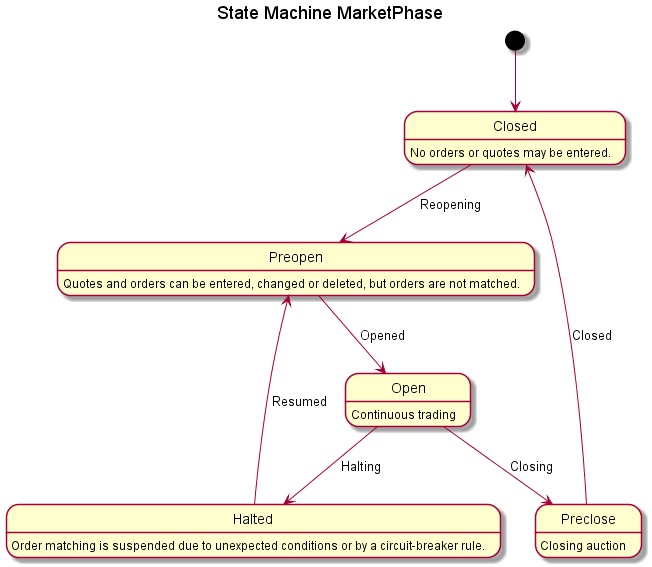

*Orchestra Concepts Part 4:*

# Actors and External States

**Messages convey information from one participant to another. Their actions and responses also depend upon persistent state information that can be defined in Orchestra.**

## Overview

The participants in a service play different roles. In FIX, the terms Party and PartyRole are very common. With respect to a trade, a party may play the role of executing firm, clearing firm, client, contra firm, and so forth. 

In Orchestra, we abstract the role of a party that sends or recieves messages as an *actor*. As explained in [Part 2: Workflow and Scenarios](https://github.com/FIXTradingCommunity/fix-orchestra/wiki/Concepts-Part2-Workflow-and-Scenarios), actors send and receive messages on flows and the exchange of messages can be defined in Orchestra using workflow features. Specifically, a message may trigger one of several possible responses, and each response can have a conditional expression that tells when that response is fired. 

Responses do not depend solely the contents of messages. The response to an order also depends whether the market is open, on other orders resting in a book, and possibly whether a limit price exceeds some daily bracket. The TradeDate field in an ExecutionReport (35=8) also depends on state information of the market (not always the same as calendar date). Orchestra supports external states in two ways: state variables of actors and state machines.

## State Variables

State variables are persistent data items associated with an actor that are external to messsages. To be clear, like message structures, Orchestra defines the format of the data, not actual instances of data. It is up to a system implementation to store data in memory or in a persistent database, etc. Orchestra defines interfaces and rules of behavior, not implementation details.

To keep it simple, Orchestra uses the same syntax to define state variables as it does to define the elements of messages. A stand-alone data item is a field, but components and repeating groups are also supported.

```xml
<fixr:actor name="Market">
	<fixr:fieldRef id="75" presence="required" scenario="base"/>
	<fixr:groupRef presence="required" id="2186" scenario="base" implMaxOccurs="unbounded">
		<fixr:annotation >
			<fixr:documentation >Repeating group of security status by SecurityID</fixr:documentation>
		</fixr:annotation>
	</fixr:groupRef>
</fixr:actor>
```

In this example, "Market" is the name of an actor that receives orders and sends executions and other messages. Its first state variable is defined as `<fixr:fieldRef id="75`, the same way a field is referenced in a message or component definition. Tag 75 is the identifier of the TradeDate field;it is of datatype LocalMktDate. In other words, Market has a persistent value of TradeDate. The state variable can be used to assign a value to TradeDate in outgoing messages. They can it can also be used in message validations through a rule with a conditional expression.

The second state variable is a reference to repeating group `<fixr:group category="SecuritiesReferenceData" id="2186" name="SecMassStatGrp" scenario="base">`. Without showing its full definition, understand that each instance of the group tells the current trading status of an instrument. In a live system,this would be held in some kind of database (possibly all cached in memory), but Orchestra provides an abstraction for the data structure with standardized semantics.

So far, the state variables reference an existing FIX field and repeating group. It is also possible to define state elements that don't correspond to existing message elements. To do that, define a `<field>` directly under the `<actor>` using a user-defined tag.

State variables become useful when a conditional expression depends on their values. Not shown here, but a message response force an update of an actor's state variable. Perhaps an order updates the current best bid or offer, for example.

## State Machines

Many interactions in financial systems are described as transitions between discreet states. A formal model of states and their transitions is called a state machine. A great example of a state machine in FIX is OrdStatus. That field has code set that corresponds to the possible states of an order. Some transitions are valid, such as New (initial state) to Partially Filled, but others are disallowed, such as Canceled to Filled. Canceled is called a terminal state; once an order is canceled, it remains dead forever.

Here's an example of a state machine for market phases:

```xml
<fixr:states name="MarketPhase">
	<fixr:initial name="Closed">
		<fixr:transition name="Reopening" target="Preopen"/>
	</fixr:initial>
	<fixr:state name="Halted">
		<fixr:transition name="Resumed" target="Preopen">
		</fixr:transition>
	</fixr:state>
	<fixr:state name="Open">
		<fixr:transition name="Halting" target="Halted"/>
		<fixr:transition name="Closing" target="Preclose"/>
	</fixr:state>
	<fixr:state name="Preopen">
		<fixr:transition name="Opened" target="Open"/>
	</fixr:state>
	<fixr:state name="Preclose">
		<fixr:transition name="Closed" target="Closed"/>
	</fixr:state>
</fixr:states>
```

In this example, there is an initial state called Closed. The other states are Halted, Open, Preopen, and Preclose. From Closed, the only valid transition is Reopening, which results in the Preopen state, and so forth. Notice that Open state has two possible transitions; one goes to Halted and the other goes to Preclose.

Here's what the state machine looks like in standard UML format:



Other features can be added to a state machine that are not illustrated here for simplicity.

* A transition can trigger an action such as sending a message. For example, when the market is opened, a session status message can be sent from one actor to another. Conversely, a message response can invoke a state machine transition such as an order state change.
* A conditional expression can be used to guard a transition so it is only allowed under certain circumstances.


### Next

[Orchestra Concepts Part 5: Service Offerings and Session Configurations](../Concepts-Part5-Service-Offerings-And-Session-Configurations)

### Back
[Orchestra Concepts Part 3: Conditional Expressions](https://github.com/FIXTradingCommunity/fix-orchestra/wiki/Concepts-Part3-Conditional-Expressions)

**© Copyright 2019 FIX Protocol Ltd.**